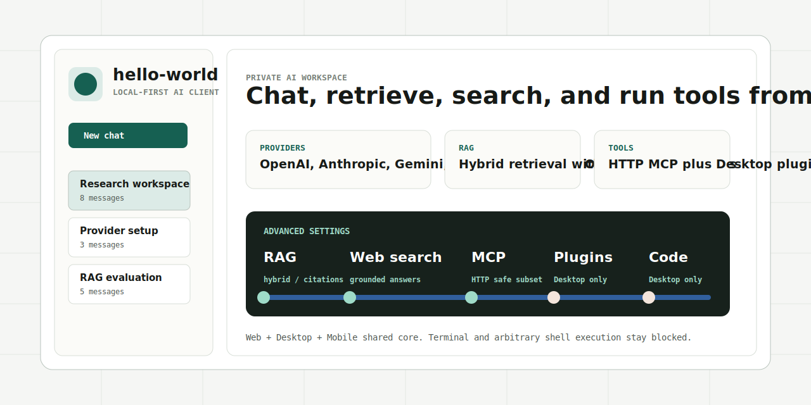
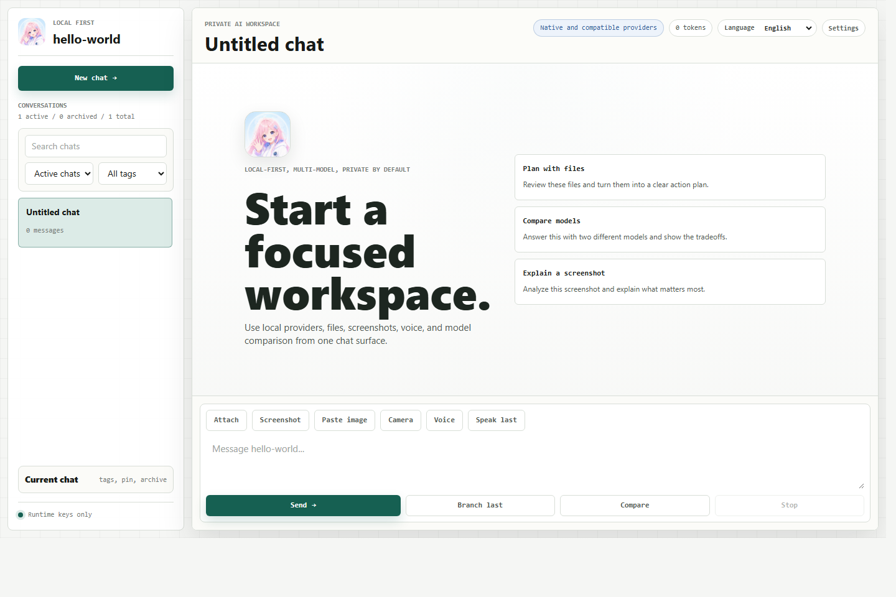
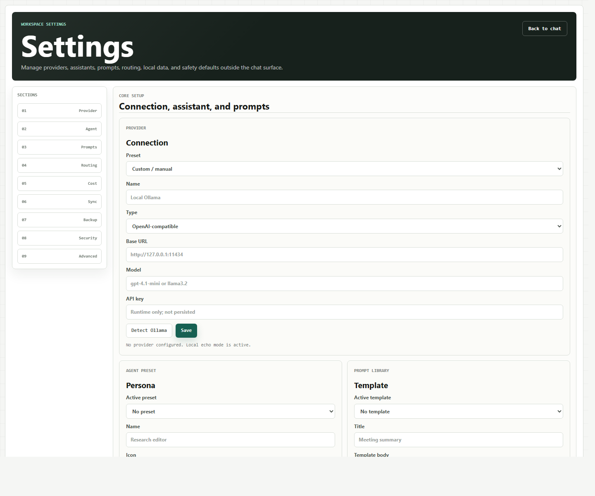
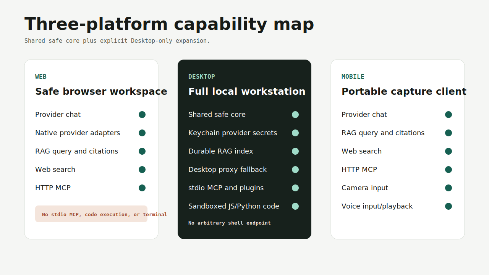
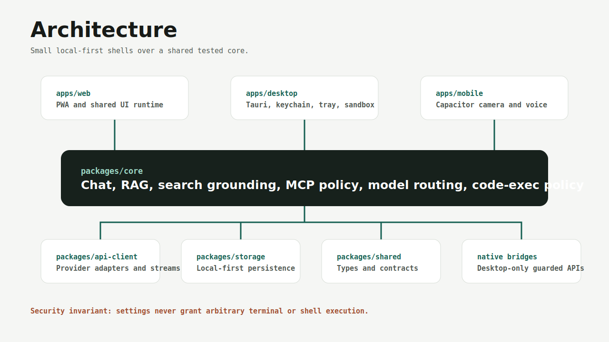
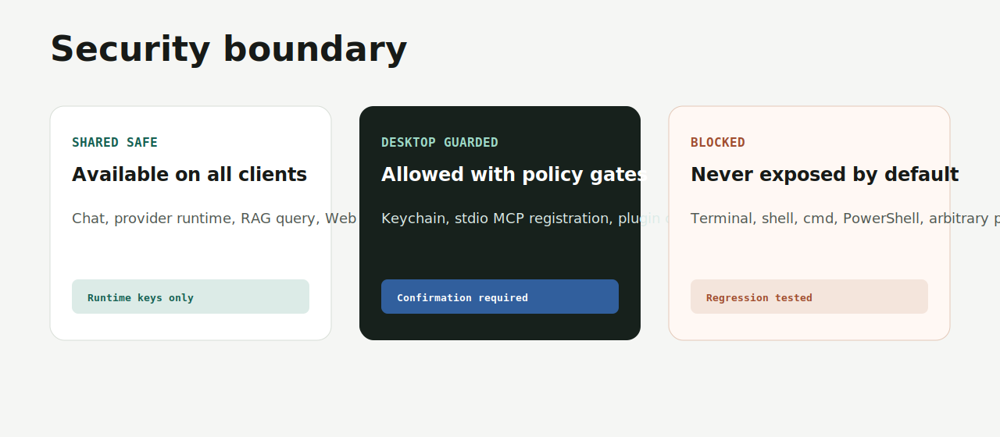

# hello-world

<div align="center">
  
  <h3>Local-first AI workspace for Web, Windows Desktop, and Mobile</h3>
  <p>本地优先、三端可用的 AI 工作台，支持多 Provider、RAG、Web search、MCP/插件和桌面端安全代码执行。</p>
  <p>
    <a href="#中文">中文</a>
    ·
    <a href="#english">English</a>
    ·
    <a href="docs/releases/v0.1.0.md">Release Notes</a>
  </p>
</div>



[](#验证--verification)
[](#平台--platforms)
[](#安全模型--security-model)
[](https://github.com/Silasvanceneo/hello-world)

## 真实界面 / Real UI

这些截图来自当前 Web 构建的真实浏览器渲染结果，不是概念图。

These screenshots are captured from the current Web build in a real browser, not mockups.





## 中文

`hello-world` 是一个本地优先、可自托管的 AI 客户端，覆盖 Web、Windows Desktop 和 Mobile。它把多模型 Provider、RAG 知识库、Web 搜索、MCP 工具、插件管理和桌面端安全代码执行集中在一个工作台里，同时把危险能力放在明确的安全边界后面。

## 为什么做它

很多 AI 客户端会在本地控制、多 Provider、知识工作流和工具执行安全之间取舍。`hello-world` 的目标是做一个个人和小团队可掌控的 AI 工作台：状态默认保留在本地，Provider 可以自由切换，终端和任意命令默认被阻断，只有平台和策略都允许时才暴露高风险能力。

## 功能概览



- Provider：OpenAI-compatible、OpenAI Responses、Anthropic、Gemini、Azure OpenAI、DashScope、Ollama，以及中转/兼容网关。
- RAG：文件摄取、切片、本地确定性 embedding、混合检索、引用、reranking 接口和评估报告。
- Web search：Brave、Tavily、Bing、SearXNG 和自定义端点，支持带引用的 grounded answers。
- MCP/插件：三端共享 HTTP MCP；桌面端支持 stdio MCP 和插件控制面，并要求确认。
- 桌面端代码执行：仅支持受控 JavaScript/Python 片段，不开放终端、cmd、PowerShell 或任意 shell。
- 设置中心：Provider、Agent、Prompt、Routing、Cost、Sync、Backup、Security、Advanced 都在独立设置工作区配置。

## 平台

| 能力 | Web | Desktop | Mobile |
| --- | --- | --- | --- |
| 云端/本地聊天 | 支持 | 支持 | 支持 |
| 原生 Provider 适配器 | 支持 | 支持 | 支持 |
| RAG 查询和引用 | 支持 | 支持 | 支持 |
| RAG 目录导入/持久索引 | 不支持 | 桌面专属 | 不支持 |
| Web search 和 grounded answers | 支持 | 支持 | 支持 |
| HTTP MCP | 支持 | 支持 | 支持 |
| stdio MCP / 插件管理器 | 不支持 | 桌面专属 | 不支持 |
| 沙箱 JS/Python 代码执行 | 不支持 | 桌面专属 | 不支持 |
| 相机输入 | 不支持 | 不支持 | 支持 |
| 语音输入/播放 | 依赖运行时 | 依赖运行时 | 依赖运行时 |
| 终端/任意 shell | 阻断 | 阻断 | 阻断 |

## 架构



```text
apps/web       PWA and shared UI runtime
apps/desktop   Tauri shell, tray, keychain, sandbox command bridge
apps/mobile    Capacitor shell with camera/share/secure-storage foundations

packages/core        chat, RAG, search grounding, MCP policy, model routing
packages/api-client  provider adapters, streaming, Web search adapters
packages/storage     local-first persistence adapters
packages/shared      shared types and contracts
```

## 安全模型



- API key 只在运行时使用，不写入本地状态或备份。
- Web 和 Mobile 不暴露 stdio MCP、桌面代理、沙箱代码执行、终端、cmd、PowerShell 或任意进程执行。
- Desktop 的代码执行只接受 `javascript` 或 `python`，要求用户确认，清空继承环境，限制超时和输出，并通过窄 Tauri command 调用。
- 关键工具即使在 UI 设置里被切换，也会被策略测试继续约束。

## 快速开始

前置依赖：

- Node.js and npm
- Rust toolchain for Desktop builds
- Android SDK for Android builds
- Optional: Ollama for local models

```powershell
npm install
npm run check
```

运行 Web 构建：

```powershell
npm run build:web
```

构建 Windows 桌面端：

```powershell
npm run build:desktop
```

构建/同步 Android Mobile 项目：

```powershell
npm run build:mobile
```

## English

`hello-world` is a local-first, self-hostable AI workspace for Web, Windows Desktop, and Mobile. It combines multi-provider chat, RAG, Web search, MCP tooling, plugin management, and Desktop-only sandboxed code execution behind explicit safety boundaries.

## Why It Exists

Most AI clients force tradeoffs between local control, multi-provider flexibility, knowledge workflows, and safe tool execution. `hello-world` is built for personal and small-team use: state stays local by default, providers are interchangeable, and dangerous capabilities stay hidden unless both platform and policy allow them.

## Capabilities

- Providers: OpenAI-compatible, OpenAI Responses, Anthropic, Gemini, Azure OpenAI, DashScope, Ollama, and relay gateways.
- RAG: ingestion, chunking, local deterministic embeddings, hybrid retrieval, citations, reranking hooks, and eval reporting.
- Web search: Brave, Tavily, Bing, SearXNG, and custom endpoints with grounded answer citation validation.
- MCP and plugins: HTTP MCP shared across all clients; Desktop stdio MCP/plugin control plane behind confirmation.
- Desktop code: controlled JavaScript/Python snippets only. Terminal, cmd, PowerShell, and arbitrary shell execution remain blocked.
- Settings workspace: Provider, Agent, Prompts, Routing, Cost, Sync, Backup, Security, and Advanced configuration live outside the chat surface.

## Platforms

| Capability | Web | Desktop | Mobile |
| --- | --- | --- | --- |
| Cloud/local chat | yes | yes | yes |
| Native provider adapters | yes | yes | yes |
| RAG query and citations | yes | yes | yes |
| RAG directory import / durable index | no | Desktop-only | no |
| Web search and grounded answers | yes | yes | yes |
| HTTP MCP | yes | yes | yes |
| stdio MCP / plugin manager | no | Desktop-only | no |
| Sandboxed JS/Python code execution | no | Desktop-only | no |
| Camera input | no | no | yes |
| Voice input/playback | runtime-dependent | runtime-dependent | runtime-dependent |
| Terminal / arbitrary shell | blocked | blocked | blocked |

## Configuration

Open the app, then go to `Settings`.

- `Provider`: provider type, base URL, model, runtime-only API key, local Ollama detection.
- `Agent`: system prompt, default model override, safe tool preferences, knowledge scope.
- `Prompts`: reusable local prompt templates.
- `Routing`: balanced, cheap, fast, long-context, privacy, and fallback routing.
- `Advanced`: RAG, Web search, MCP/plugins, Desktop code execution, and platform capabilities.
- `Security`: blocked terminal, code execution, stdio MCP, and broad filesystem defaults.

## 验证 / Verification

Current local verification:

```powershell
npm run check
npm run build:desktop
npm run build:mobile
npm audit --omit=dev --audit-level=moderate
```

Latest verified state:

- `npm run check`: scaffold check passed, 215 tests passed, Web build passed, review gate passed.
- `npm run build:desktop`: built `apps/desktop/src-tauri/target/release/hello-world-desktop.exe`.
- `npm run build:mobile`: Capacitor Android sync and scaffold verification passed.
- `npm audit --omit=dev --audit-level=moderate`: 0 vulnerabilities.

## Release

Release notes are maintained in [docs/releases/v0.1.0.md](docs/releases/v0.1.0.md).

GitHub Release assets:

- `hello-world-desktop.exe`
- `app-debug.apk`

## Documentation

- [Final capability matrix](docs/FINAL_CAPABILITY_MATRIX.md)
- [Provider adapters](docs/PROVIDER_ADAPTERS.md)
- [Knowledge base and RAG](docs/KNOWLEDGE_BASE.md)
- [Web search](docs/WEB_SEARCH.md)
- [Tool security](docs/TOOL_SECURITY.md)
- [Desktop notes](docs/DESKTOP.md)
- [Mobile notes](docs/MOBILE.md)

## Project Status

The P5-P10 roadmap is implemented and checkpointed:

- Native provider runtime and adapters
- Mature RAG ingestion/retrieval/evals
- HTTP MCP plus Desktop stdio MCP/plugin control plane
- Web search and grounded answers
- Desktop-only sandboxed code execution
- Three-platform capability matrix
- Visible Advanced Settings configuration
