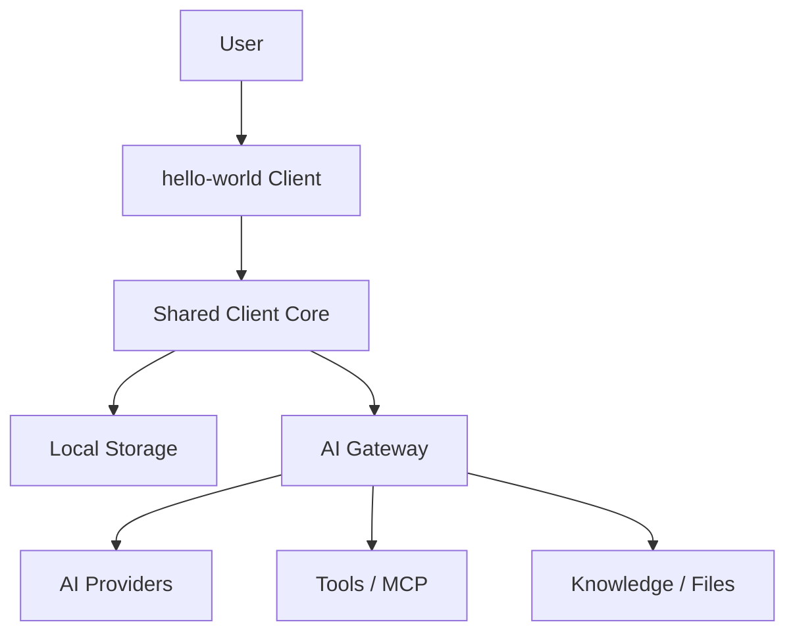

# hello-world 三端 AI 客户端完整项目计划书

版本：v0.1  
日期：2026-04-28  
项目名：`hello-world`  
产品形态：Web + Desktop + Mobile 三端 AI 客户端  
基础来源：基于现有 HaloWebUI / Open WebUI fork 能力进行重构与产品化  

---

## 目录

1. 项目摘要
2. 背景与机会
3. 产品定位
4. 目标用户与使用场景
5. 明确不做的范围
6. 产品原则
7. 三端定义与能力边界
8. 核心功能蓝图
9. 目标技术架构
10. 推荐代码结构
11. 核心协议与数据模型
12. Provider 与模型能力系统
13. 聊天核心设计
14. 文件与知识库设计
15. 本地优先与同步设计
16. MCP / 工具安全设计
17. 桌面端能力设计
18. 移动端能力设计
19. Web / PWA 能力设计
20. UI / UX 与品牌方向
21. 安全与隐私
22. 性能优化
23. 测试策略
24. 构建、发布与部署
25. P0 详细计划
26. P1 详细计划
27. P2 详细计划
28. 功能矩阵
29. 里程碑与验收标准
30. 风险清单与缓解策略
31. 文档计划
32. 后续执行建议

---

## 1. 项目摘要

`hello-world` 是一个面向个人和小团队的三端 AI 客户端，目标是在 Web、桌面端、移动端提供统一、稳定、安全、可扩展的 AI 使用体验。

它不是企业 SaaS 平台，也不是复杂工作流系统，而是一个本地优先、可自托管、可连接多模型、多工具、多知识库的 AI 工作客户端。

核心目标：

- 一套核心代码支持三端。
- 一套 Provider 抽象支持多个模型供应商。
- 一套聊天协议承载文本、图片、文件、工具调用、reasoning、引用、token usage。
- 本地优先保存聊天历史、配置和草稿。
- 桌面端支持本地 Ollama、本地 MCP、截图问答。
- 移动端支持拍照问答、语音输入、离线查看历史。
- Web 端支持 PWA、自托管入口和轻量管理。

---

## 2. 背景与机会

当前 AI 客户端常见问题：

1. **模型分散**  
   OpenAI、Claude、Gemini、Grok、Ollama、自定义 OpenAI-compatible 服务各自配置复杂。

2. **体验割裂**  
   Web、桌面端、移动端通常是三套体验，聊天历史和设置不同步。

3. **文件问答不顺手**  
   用户真正需要的是拖拽文件、拍照、截图、选中文本后直接问，而不是复杂知识库配置。

4. **本地能力缺失**  
   桌面端应该能用本地 Ollama、本地文件夹、本地 MCP、本地快捷键，而不是单纯网页壳。

5. **安全边界不清晰**  
   MCP、代码执行、Terminal、文件系统访问都很强，但很多项目默认缺少可理解的权限提示。

`hello-world` 的机会点：

- 保留 HaloWebUI 已有的多模型、RAG、MCP、Analytics 基础能力。
- 把产品重心从“Web 后台”改成“三端 AI 客户端”。
- 先服务个人与小团队，避免一开始陷入企业多租户和 SaaS 计费复杂度。

---

## 3. 产品定位

### 3.1 一句话定位

`hello-world` 是一个本地优先、三端统一、多模型可连接的个人 AI 工作客户端。

### 3.2 产品关键词

- AI Client
- Local-first
- Multi-provider
- Cross-platform
- Self-hosted
- Safe tools
- Knowledge-friendly
- Developer-friendly

### 3.3 产品目标

让用户可以在一个客户端里完成：

- 管理多个 AI Provider。
- 使用同一套聊天体验调用不同模型。
- 在 Web、桌面端、移动端继续同一项工作。
- 使用文件、图片、截图、语音作为输入。
- 管理个人知识库与会话临时知识。
- 安全地使用 MCP 和本地工具。
- 了解自己的 token 用量与估算成本。

---

## 4. 目标用户与使用场景

### 4.1 用户画像

#### 用户 A：个人开发者

需求：

- 使用 Claude / OpenAI / Ollama 写代码。
- 桌面端能截图问问题。
- 能连接本地 MCP。
- 希望历史保存在本地，可同步到自托管服务器。

关键功能：

- Desktop
- 本地 Ollama
- 本地 MCP
- 多模型对比
- 代码块体验

#### 用户 B：AI 重度办公用户

需求：

- 上传 PDF / Word / Excel 做总结。
- 移动端拍照提问。
- Web 端管理历史和知识库。
- 不想配置复杂参数。

关键功能：

- 文件问答
- 知识库
- 移动端拍照
- Prompt 模板

#### 用户 C：小团队自托管管理员

需求：

- 部署一个内部 AI 客户端。
- 配好共享模型连接。
- 看基础 token 用量。
- 限制高危工具。

关键功能：

- 简单用户系统
- Provider 连接管理
- 基础用量统计
- 工具权限开关

### 4.2 Jobs To Be Done

- 当我有多个 API Key 时，我想在一个地方配置和测试它们。
- 当我看到屏幕上的错误时，我想截图后直接问 AI。
- 当我在手机上看到纸质材料时，我想拍照问 AI。
- 当我上传一个 PDF 时，我想直接问内容并看到引用来源。
- 当我在不同设备间切换时，我想继续之前的聊天。
- 当 AI 要调用工具时，我想知道它要做什么，并能允许或拒绝。
- 当我使用多个模型时，我想知道哪个更快、更便宜、更适合当前任务。

---

## 5. 明确不做的范围

P0/P1/P2 暂不做：

- 完整 SaaS 计费系统
- 充值、余额、订单、发票
- 多租户企业后台
- 插件市场商业化
- 复杂工作流编排平台
- 大规模团队权限 / 企业级 RBAC
- 企业 SSO / SCIM / 审批流
- 插件付费分发
- 大型组织审计合规平台

允许保留的轻量能力：

- 简单管理员 / 普通用户角色
- 基础 token 用量统计
- 本地费用估算
- 简单共享配置
- 简单 Agent 预设
- Prompt 模板

---

## 6. 产品原则

### 6.1 本地优先

聊天历史、草稿、常用设置应优先在本地可用。同步是增强能力，不是基础功能的前置条件。

### 6.2 三端复用

不要维护三套业务逻辑。Web、Desktop、Mobile 应尽量复用：

- UI 组件
- Chat core
- API client
- Provider registry
- Storage interface
- Shared types

### 6.3 安全默认关闭

以下能力默认关闭：

- Terminal
- 本地命令执行
- stdio MCP
- Code execution
- 文件系统宽权限访问

### 6.4 Provider 抽象优先

不能让每个模型供应商都污染 UI。不同 Provider 的差异应收敛在 `api-client` 和 `ProviderAdapter` 里。

### 6.5 先做日常高频体验

优先级高于“企业后台”的能力：

- 稳定流式聊天
- 文件问答
- 截图问答
- 拍照问答
- 多模型连接
- 本地历史
- 清晰错误提示

---

## 7. 三端定义与能力边界

| 端 | 定位 | 主要能力 | 禁止或限制 |
|---|---|---|---|
| Web | 自托管入口 / PWA | 聊天、配置、历史、知识库、管理 | 默认禁止本地命令、stdio MCP |
| Desktop | 高能力本地客户端 | 截图、快捷键、本地 Ollama、本地 MCP、本地文件夹 | 高危工具需要确认 |
| Mobile | 轻量随身客户端 | 拍照、语音、查看历史、轻量聊天 | 禁止 stdio MCP 和本地 shell |

---

## 8. 核心功能蓝图



核心模块：

1. Provider Management
2. Chat Core
3. Session Management
4. File Input
5. Knowledge Base
6. Local Storage
7. Sync
8. Tool / MCP Permissions
9. Usage Analytics
10. Desktop Integration
11. Mobile Integration
12. Settings / Preferences

---

## 9. 目标技术架构

### 9.1 推荐技术栈

| 层 | 技术 |
|---|---|
| Web UI | SvelteKit |
| Desktop | Tauri |
| Mobile | Capacitor |
| Shared language | TypeScript |
| Backend | FastAPI |
| Default DB | SQLite |
| Server DB | PostgreSQL |
| Cache / realtime optional | Redis |
| Vector store | Chroma / pgvector first |
| Build | npm / Vite / Python |
| Package strategy | npm workspaces |

### 9.2 总体架构

```text
apps/web
  uses packages/ui
  uses packages/core
  uses packages/api-client
  uses packages/storage

apps/desktop
  Tauri shell
  loads web UI
  adds native APIs: screenshot, keychain, filesystem, local MCP

apps/mobile
  Capacitor shell
  loads mobile optimized UI
  adds native APIs: camera, share sheet, secure storage

server/open_webui
  FastAPI
  AI Gateway
  sync APIs
  file parsing
  knowledge APIs
  usage APIs
```

---

## 10. 推荐代码结构

```text
hello-world/
├─ apps/
│  ├─ web/
│  │  ├─ src/
│  │  ├─ static/
│  │  └─ package.json
│  ├─ desktop/
│  │  ├─ src-tauri/
│  │  └─ package.json
│  └─ mobile/
│     ├─ android/
│     ├─ ios/
│     ├─ capacitor.config.ts
│     └─ package.json
├─ packages/
│  ├─ shared/
│  │  ├─ src/types/
│  │  ├─ src/errors/
│  │  └─ src/constants/
│  ├─ api-client/
│  │  ├─ src/providers/
│  │  ├─ src/streaming/
│  │  └─ src/client.ts
│  ├─ core/
│  │  ├─ src/chat/
│  │  ├─ src/session/
│  │  ├─ src/model-registry/
│  │  └─ src/settings/
│  ├─ storage/
│  │  ├─ src/indexeddb/
│  │  ├─ src/sqlite/
│  │  └─ src/sync/
│  └─ ui/
│     ├─ src/components/
│     ├─ src/layouts/
│     └─ src/theme/
├─ server/
│  └─ open_webui/
├─ docs/
├─ scripts/
└─ package.json
```

---

## 11. 核心协议与数据模型

### 11.1 Provider

```ts
export type ProviderType =
  | 'openai'
  | 'anthropic'
  | 'gemini'
  | 'grok'
  | 'ollama'
  | 'openai-compatible'
  | 'custom';

export type ProviderConnection = {
  id: string;
  type: ProviderType;
  name: string;
  baseUrl?: string;
  apiKeyRef?: string;
  enabled: boolean;
  createdAt: string;
  updatedAt: string;
};
```

### 11.2 Model

```ts
export type AIModel = {
  id: string;
  providerId: string;
  displayName: string;
  ownedBy?: string;
  capability: ModelCapability;
  status: 'available' | 'unavailable' | 'unknown';
};
```

### 11.3 Chat Session

```ts
export type ChatSession = {
  id: string;
  title: string;
  folderId?: string;
  messages: ChatMessage[];
  modelId?: string;
  tags: string[];
  createdAt: string;
  updatedAt: string;
  syncState: 'local' | 'synced' | 'dirty' | 'conflict';
};
```

### 11.4 Message Content

```ts
export type MessageContent =
  | { type: 'text'; text: string }
  | { type: 'image'; fileId: string; mimeType: string }
  | { type: 'file'; fileId: string; name: string; mimeType: string }
  | { type: 'tool-call'; toolCallId: string; name: string; args: unknown }
  | { type: 'tool-result'; toolCallId: string; result: unknown }
  | { type: 'reasoning'; text: string }
  | { type: 'citation'; sourceId: string; label: string };
```

### 11.5 Token Usage

```ts
export type TokenUsage = {
  promptTokens: number;
  completionTokens: number;
  totalTokens: number;
  estimatedCost?: number;
  currency?: 'USD' | 'CNY';
};
```

---

## 12. Provider 与模型能力系统

### 12.1 Provider Adapter 接口

```ts
export interface ProviderAdapter {
  id: string;
  type: ProviderType;
  listModels(connection: ProviderConnection): Promise<AIModel[]>;
  chat(request: ChatRequest): AsyncIterable<ChatChunk>;
  validateConnection(connection: ProviderConnection): Promise<ConnectionStatus>;
  generateImage?(request: ImageRequest): Promise<ImageResult>;
}
```

### 12.2 模型能力

```ts
export type ModelCapability = {
  supportsText: boolean;
  supportsVision: boolean;
  supportsFiles: boolean;
  supportsTools: boolean;
  supportsReasoning: boolean;
  supportsImageGeneration: boolean;
  supportsAudioInput: boolean;
  supportsAudioOutput: boolean;
  contextWindow?: number;
  maxOutputTokens?: number;
};
```

### 12.3 UI 行为

| 能力 | UI 行为 |
|---|---|
| supportsVision | 显示图片上传、截图、拍照入口 |
| supportsFiles | 显示文件上传入口 |
| supportsTools | 显示工具开关 |
| supportsReasoning | 显示思考强度设置 |
| supportsImageGeneration | 显示图像生成入口 |
| contextWindow | 显示长上下文提示 |

---

## 13. 聊天核心设计

### 13.1 聊天状态机

```text
idle
  -> composing
  -> sending
  -> streaming
  -> completed
  -> failed
  -> retrying
  -> aborted
```

### 13.2 必备能力

- 新建会话
- 自动命名会话
- 编辑消息
- 重试消息
- 停止生成
- 继续生成
- 分支对话
- 多模型对比
- 消息复制
- Markdown 渲染
- 代码块复制
- LaTeX / Mermaid 可选渲染
- 错误卡片
- token usage 展示

### 13.3 Streaming Chunk

```ts
export type ChatChunk =
  | { type: 'text-delta'; text: string }
  | { type: 'reasoning-delta'; text: string }
  | { type: 'tool-call-start'; id: string; name: string }
  | { type: 'tool-call-delta'; id: string; argsDelta: string }
  | { type: 'tool-call-end'; id: string }
  | { type: 'usage'; usage: TokenUsage }
  | { type: 'error'; error: ChatError }
  | { type: 'done' };
```

---

## 14. 文件与知识库设计

### 14.1 文件类型优先级

P0：

- TXT
- Markdown
- PDF
- PNG / JPG / WebP

P1：

- DOCX
- XLSX
- PPTX
- HTML
- OCR 图片

P2：

- 文件夹知识库
- 网页收藏
- 导入外部聊天记录

### 14.2 临时文件与长期知识库

| 类型 | 作用 | 生命周期 |
|---|---|---|
| 会话附件 | 当前聊天上下文 | 跟随会话 |
| 临时知识 | 当前会话内检索 | 可手动转长期 |
| 长期知识库 | 多会话复用 | 用户管理 |
| 本地文件夹知识库 | 桌面端专属 | 用户授权 |

### 14.3 引用设计

回答中应支持：

- 来源文件名
- PDF 页码
- 文本片段
- 点击定位
- 引用折叠

---

## 15. 本地优先与同步设计

### 15.1 本地优先原则

- 离线可以打开历史。
- 写入先落本地。
- 同步失败不影响本地使用。
- 冲突可见，不静默覆盖。

### 15.2 Sync State

```ts
export type SyncState =
  | 'local'
  | 'synced'
  | 'dirty'
  | 'syncing'
  | 'conflict'
  | 'error';
```

### 15.3 同步范围

P0：

- 不强制同步，先保证本地历史。

P1：

- 设置同步
- 会话元数据同步

P2：

- 聊天历史同步
- Prompt/Agent 同步
- 知识库元数据同步
- 冲突处理

---

## 16. MCP / 工具安全设计

### 16.1 工具分级

| 等级 | 示例 | 策略 |
|---|---|---|
| Low | 时间、只读搜索 | 可自动执行 |
| Medium | HTTP API、读取知识库 | 首次确认 |
| High | 文件写入、本地命令 | 每次确认 |
| Critical | shell、删除、网络代理 | 默认禁止 |

### 16.2 三端限制

| 能力 | Web | Desktop | Mobile |
|---|---|---|---|
| HTTP MCP | 允许 | 允许 | 允许 |
| stdio MCP | 禁止 | 可授权 | 禁止 |
| 本地文件读 | 浏览器沙箱 | 可授权 | App 沙箱 |
| 本地 shell | 禁止 | 默认禁止，可高级开启 | 禁止 |

### 16.3 工具调用确认卡片

确认卡片必须显示：

- 工具名称
- 作用说明
- 参数摘要
- 风险等级
- 允许一次 / 总是允许 / 拒绝

---

## 17. 桌面端能力设计

桌面端不应只是网页壳，应提供本地增强：

P0：

- Tauri shell
- 本地窗口
- 本地配置
- 基础聊天

P1：

- 截图问 AI
- 剪贴板图片问 AI
- 全局快捷键
- 系统托盘
- 本地 Ollama 检测
- Keychain 保存密钥

P2：

- 本地文件夹知识库
- 本地 MCP 管理
- 自动更新
- 选中文字后问 AI

---

## 18. 移动端能力设计

P0：

- Capacitor shell
- 移动端聊天布局
- 本地历史

P1：

- 拍照问 AI
- 语音输入
- 语音朗读
- 分享到 hello-world
- Secure Storage

P2：

- 推送通知
- 离线收藏
- 移动端快捷 Prompt
- 扫描文档问答

移动端禁止：

- stdio MCP
- 本地 shell
- 任意文件系统扫描

---

## 19. Web / PWA 能力设计

P0：

- Web 访问
- PWA manifest
- 响应式布局
- IndexedDB 历史

P1：

- 离线查看历史
- PWA 安装提示
- 文件拖拽
- Web Share Target 可选

P2：

- 浏览器本地模型能力可选
- 本地-only 密钥模式增强
- 多窗口会话支持

---

## 20. UI / UX 与品牌方向

### 20.1 品牌名

`hello-world`

含义：

- 对开发者友好。
- 表达第一次连接世界。
- 符合多模型入口定位。
- 简单、轻快、容易记住。

### 20.2 图标方向

用户偏好：二次元女性图标。

建议设定：

- 原创二次元 AI 助手女性角色。
- 银蓝色或紫蓝色发色。
- 明亮、聪明、可信赖。
- 圆角方形 app icon。
- 不出现文字，避免小尺寸不可读。
- 背景使用蓝紫渐变、发光节点、轻微 halo。

### 20.3 UI 风格

- 现代、简洁、清晰。
- 聊天区域优先。
- 设置界面降低复杂度。
- 高危工具使用红色/橙色风险提示。
- Provider 连接使用向导式配置。

---

## 21. 安全与隐私

### 21.1 API Key 策略

P0：

- 输入框遮罩。
- 不在前端完整展示已保存密钥。
- 删除连接时清理密钥。

P1：

- Desktop 使用系统 Keychain。
- Mobile 使用 Secure Storage。
- Web 支持 local-only key。

P2：

- 可选端到端加密同步。

### 21.2 数据保护

- 聊天导出支持脱敏。
- 错误日志不记录完整 API Key。
- 工具调用日志隐藏敏感参数。
- 文件上传前提示是否发送到远程模型。

### 21.3 默认安全设置

默认关闭：

- Terminal
- Code execution
- stdio MCP
- 本地命令
- 任意目录访问

---

## 22. 性能优化

P0：

- 大聊天懒加载。
- Markdown 基础渲染。
- 文件大小限制。
- 流式输出不卡 UI。

P1：

- 消息虚拟列表。
- 代码高亮延迟加载。
- Mermaid / LaTeX 按需渲染。
- 图片上传压缩。
- 附件懒加载。

P2：

- 会话索引。
- 本地全文搜索。
- 同步增量上传。
- 多端缓存策略。

---

## 23. 测试策略

### 23.1 单元测试

- Provider adapter
- streaming parser
- model capability detection
- local storage
- error normalization
- token usage parser

### 23.2 集成测试

- 添加 Provider
- 测试连接
- 拉取模型
- 发送聊天
- 上传文件
- 保存历史

### 23.3 E2E 测试

P0 必须覆盖：

- Web 登录并聊天
- Desktop 启动并聊天
- Mobile 启动并进入聊天页
- 停止生成
- 重试生成
- 历史刷新后仍存在

### 23.4 安全测试

- API Key 不泄露到日志。
- 默认不能访问 shell。
- Mobile 不能启用 stdio MCP。
- 工具调用确认生效。

---

## 24. 构建、发布与部署

### 24.1 Web

- `npm run build:web`
- Docker 部署
- PWA manifest
- Nginx 反代文档

### 24.2 Desktop

- `npm run build:desktop`
- Windows `.msi` 或 `.exe`
- macOS `.dmg`
- Linux `.AppImage` 或 `.deb`

P0 可先只要求 Windows 调试版。

### 24.3 Mobile

- `npm run build:mobile`
- Android debug APK
- iOS 后续再做签名发布

P0 可先只要求 Android debug APK。

### 24.4 Server

- Docker image
- SQLite 默认
- PostgreSQL 推荐生产部署
- 数据卷持久化

---

## 25. P0 详细计划

## P0 总目标

完成一个可以真实使用的三端 MVP：

- Web 可部署。
- Desktop 可运行。
- Mobile 可打包。
- 能连接主流模型。
- 能完成基础聊天。
- 能保存本地历史。
- 能上传基础文件。
- 默认安全。

### P0-M1：项目结构与基础迁移

任务：

1. 建立 `apps/`、`packages/`、`server/` 目录。
2. 将现有 Svelte 前端迁移到 `apps/web`。
3. 将现有 FastAPI 后端迁移到 `server/open_webui` 或保留路径并建立映射。
4. 建立 npm workspaces。
5. 新建 `packages/shared`。
6. 新建 `packages/api-client`。
7. 新建 `packages/core`。
8. 新建 `packages/ui`。

验收：

- Web 能正常启动。
- 旧有聊天页能访问。
- TypeScript build 不因路径迁移失败。
- 后端能启动。

### P0-M2：Provider 连接管理

任务：

1. 定义 `ProviderConnection` 类型。
2. 定义 `ProviderAdapter` 接口。
3. 实现 OpenAI-compatible adapter。
4. 实现 Ollama adapter。
5. 接入 Anthropic / Gemini / Grok 现有后端 API。
6. 建立连接测试 UI。
7. 标准化错误类型。

验收：

- 可添加连接。
- 可测试连接。
- 可显示模型列表。
- 错误能区分 API Key 错误、网络错误、模型错误。

### P0-M3：统一聊天核心

任务：

1. 定义 `ChatSession`、`ChatMessage`、`ChatChunk`。
2. 抽出 streaming parser。
3. 实现发送消息。
4. 实现停止生成。
5. 实现重试。
6. 实现编辑用户消息后重新生成。
7. 实现本地保存。

验收：

- 至少 OpenAI-compatible 可流式聊天。
- 至少 Ollama 可聊天。
- 至少一个非 OpenAI Provider 可聊天。
- 刷新后历史不丢。

### P0-M4：本地存储

任务：

1. Web IndexedDB adapter。
2. Desktop local storage adapter。
3. Mobile local storage adapter。
4. 定义统一 `StorageAdapter`。
5. 会话保存。
6. 设置保存。
7. Provider connection 保存。

验收：

- 三端重启后历史存在。
- 删除会话生效。
- 设置修改后持久化。

### P0-M5：基础文件输入

任务：

1. 图片上传。
2. TXT / MD 解析。
3. PDF 文本提取。
4. 文件绑定到会话。
5. 不支持文件的模型给出提示。

验收：

- 图片可发送给 vision 模型。
- PDF/TXT 可作为上下文。
- 文件可删除。

### P0-M6：三端壳

任务：

1. Web PWA 基础配置。
2. Tauri 初始化。
3. Tauri 加载 Web UI。
4. Capacitor 初始化。
5. Android debug build。
6. 三端共享 core/api-client/ui。

验收：

- Web 能访问。
- Windows Desktop 能启动。
- Android debug APK 能启动。
- 三端能进入聊天页。

### P0-M7：基础用量统计

任务：

1. 记录 prompt tokens。
2. 记录 completion tokens。
3. 记录 total tokens。
4. 按模型聚合。
5. 按天聚合。
6. 会话内展示 token usage。

验收：

- 每次聊天后有 usage。
- 管理页能看到模型用量。

### P0-M8：默认安全策略

任务：

1. Terminal 默认关闭。
2. Code execution 默认关闭。
3. stdio MCP 默认关闭。
4. 工具调用确认 UI。
5. API Key 脱敏。
6. 错误日志脱敏。

验收：

- 新安装默认没有 shell 能力。
- 高危能力需要显式开启。
- 前端不展示完整 API Key。

### P0 Definition of Done

- Web 端可部署。
- Windows 桌面端可启动并聊天。
- Android 调试包可启动并聊天。
- 至少 3 个 Provider 可用。
- 聊天历史可本地持久化。
- 基础文件上传可用。
- 高危能力默认关闭。
- 有 README 和运行说明。

---

## 26. P1 详细计划

## P1 总目标

让 `hello-world` 从“能用”变成“日常好用”。

### P1-M1：模型能力注册表

- 自动识别模型能力。
- UI 动态显示功能。
- 长上下文提示。
- reasoning 设置。

### P1-M2：多模型对比

- 同一 prompt 多模型并排输出。
- 显示速度、token、错误。
- 选择一个回答保存为主分支。

### P1-M3：文件知识库增强

- 拖拽文件即问。
- 会话临时知识库。
- 长期知识库。
- PDF 页码引用。
- DOCX / XLSX 基础解析。
- OCR 可选。

### P1-M4：桌面端增强

- 截图问 AI。
- 剪贴板图片问 AI。
- 全局快捷键。
- 系统托盘。
- 本地 Ollama 检测。
- Keychain 保存密钥。

### P1-M5：移动端增强

- 拍照问 AI。
- 语音输入。
- 语音朗读。
- 分享到 hello-world。
- Secure Storage。

### P1-M6：连接诊断

- 一键健康检查。
- 常见错误解释。
- 证书错误提示。
- 代理错误提示。
- 模型列表失败 fallback。

### P1 Definition of Done

- 多模型对比可用。
- 桌面端截图问答可用。
- 移动端拍照问答可用。
- 文件知识库可用于 PDF/TXT/MD/DOCX。
- API Key 安全存储策略落地。
- 常见连接错误可读。

---

## 27. P2 详细计划

## P2 总目标

把 `hello-world` 做成个人 AI 工作台，但不进入企业 SaaS 范围。

### P2-M1：简单 Agent 预设

字段：

- Agent name
- System prompt
- Default model
- Enabled tools
- Knowledge base
- Icon

### P2-M2：Prompt 模板库

- 模板收藏。
- 变量输入。
- 标签分类。
- 导入导出。
- 本地模板和同步模板。

### P2-M3：智能模型路由

策略：

- 便宜优先。
- 快速优先。
- 长上下文优先。
- 视觉任务优先。
- 失败 fallback。

### P2-M4：用量与费用估算

- 模型价格表。
- 单次请求费用估算。
- 每日 / 每月 token 趋势。
- 本地预算提醒。

不做真实扣费。

### P2-M5：同步能力

- 聊天历史同步。
- 设置同步。
- Prompt/Agent 同步。
- 知识库元数据同步。
- 冲突处理。

### P2-M6：导入导出

- Markdown 导出。
- JSON 备份。
- Open WebUI 导入。
- ChatGPT 导入。
- 单会话导出。
- 全量备份恢复。

### P2 Definition of Done

- Agent 预设可日常使用。
- Prompt 模板库可导入导出。
- 模型路由可按简单策略自动选模型。
- 用量费用估算可查看。
- 多端同步有冲突处理。
- 用户可完整备份和恢复数据。

---

## 28. 功能矩阵

| 功能 | Web P0 | Desktop P0 | Mobile P0 | P1 | P2 |
|---|---:|---:|---:|---|---|
| 基础聊天 | 是 | 是 | 是 | 增强 | 增强 |
| 流式响应 | 是 | 是 | 是 | 增强 | 增强 |
| 停止生成 | 是 | 是 | 是 | - | - |
| 重试生成 | 是 | 是 | 是 | - | - |
| 本地历史 | 是 | 是 | 是 | 搜索增强 | 同步 |
| Provider 管理 | 是 | 是 | 是 | 诊断增强 | 路由 |
| 图片输入 | 是 | 是 | 是 | 截图/拍照 | 多模态增强 |
| PDF/TXT/MD | 是 | 是 | 是 | 引用增强 | 知识库增强 |
| DOCX/XLSX | 否 | 否 | 否 | 是 | 增强 |
| 本地 Ollama | 通过后端 | 是 | 远程 | 增强 | 增强 |
| HTTP MCP | 可选 | 可选 | 可选 | 权限增强 | 工具预设 |
| stdio MCP | 禁止 | 可授权 | 禁止 | 增强 | 增强 |
| 截图问答 | 否 | 否 | 否 | Desktop | 增强 |
| 拍照问答 | 否 | 否 | 否 | Mobile | 增强 |
| Agent 预设 | 否 | 否 | 否 | 否 | 是 |
| Prompt 模板 | 基础 | 基础 | 基础 | 增强 | 完整 |
| 费用估算 | 否 | 否 | 否 | 否 | 是 |
| 多端同步 | 否 | 否 | 否 | 设置同步 | 聊天同步 |

---

## 29. 里程碑与验收标准

| 阶段 | 里程碑 | 验收 |
|---|---|---|
| P0-M1 | 结构重组 | apps/packages/server 建立，Web/Server 能启动 |
| P0-M2 | Provider 管理 | 连接新增、测试、模型列表可用 |
| P0-M3 | 聊天核心 | 流式、停止、重试、历史保存 |
| P0-M4 | 本地存储 | 三端重启后历史存在 |
| P0-M5 | 文件输入 | 图片/PDF/TXT/MD 可用 |
| P0-M6 | 三端壳 | Web/Desktop/Android 可运行 |
| P0-M7 | 用量统计 | 会话和模型 token 可查看 |
| P0-M8 | 安全默认值 | 高危能力默认关闭 |
| P1 | 高频体验 | 截图、拍照、多模型、知识库增强 |
| P2 | 个人工作台 | Agent、Prompt、路由、同步、导入导出 |

---

## 30. 风险清单与缓解策略

| 风险 | 影响 | 缓解 |
|---|---|---|
| 现有代码耦合重 | 拆包困难 | 先抽 shared/api-client，不先大改 UI |
| 三端维护成本高 | 开发慢 | 复用 Svelte UI + core |
| Tauri/Capacitor 平台差异 | 调试成本 | P0 先 Windows + Android |
| API Key 安全 | 泄露风险 | P1 引入 Keychain/Secure Storage |
| MCP 工具风险 | 本地安全问题 | 默认关闭 + 风险分级 + 每次确认 |
| 文件解析慢 | 体验差 | P0 轻量解析，P1 索引化 |
| 同步冲突复杂 | 数据丢失 | P2 才做完整同步，先本地优先 |
| 依赖安全告警 | 发布风险 | P0 前做 npm audit 和关键依赖升级 |

---

## 31. 文档计划

必须文档：

- `README.md`
- `docs/HELLO_WORLD_PROJECT_PLAN.md`
- `docs/TARGET_ARCHITECTURE.md`
- `docs/FEATURE_MATRIX.md`
- `docs/PROVIDER_ADAPTERS.md`
- `docs/CHAT_PROTOCOL.md`
- `docs/SECURITY_MODEL.md`
- `docs/DESKTOP.md`
- `docs/MOBILE.md`
- `docs/DEPLOYMENT.md`

---

## 32. 后续执行建议

建议立即执行顺序：

1. 确认本计划作为范围基线。
2. 建立正式仓库结构。
3. 先做 P0-M1，不碰复杂新功能。
4. 抽 `shared types`。
5. 抽 `api-client`。
6. 抽 `chat core`。
7. 建立 Web build 验证。
8. 初始化 Tauri。
9. 初始化 Capacitor。
10. 逐步迁移 Provider 和聊天功能。

第一批实际文件建议：

```text
docs/HELLO_WORLD_PROJECT_PLAN.md
docs/TARGET_ARCHITECTURE.md
docs/FEATURE_MATRIX.md
docs/SECURITY_MODEL.md
packages/shared/src/types/chat.ts
packages/shared/src/types/provider.ts
packages/api-client/src/provider-adapter.ts
packages/core/src/chat/chat-store.ts
```

---

## 结论

`hello-world` 的最佳路线不是重写一个全新 AI 客户端，而是把 HaloWebUI 现有能力拆解成三端可复用的 AI Client 架构。

短期目标是 P0：可用、稳定、安全默认关闭。  
中期目标是 P1：截图、拍照、多模型、文件知识库等高频体验。  
长期目标是 P2：Agent、Prompt、模型路由、同步、导入导出，形成个人 AI 工作台。

只要坚持“不做复杂 SaaS、不做大企业后台、不做插件市场商业化”，项目范围就是可控的。
